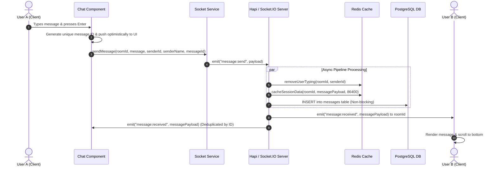
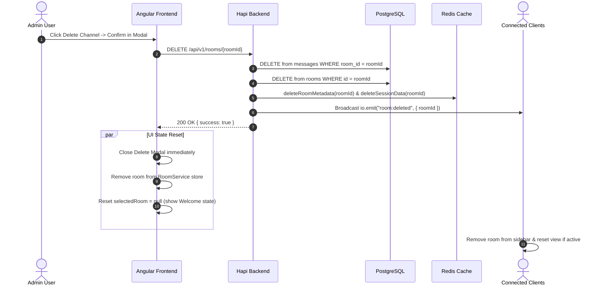
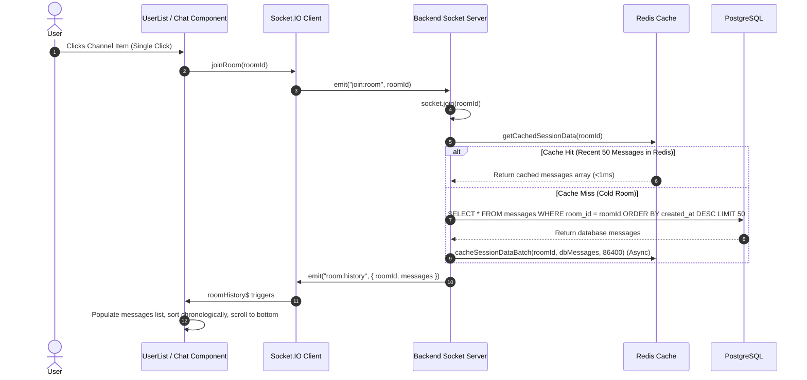

# Low-Level Design (LLD) Document
# Real-Time Chat Application (Full Stack + WebSocket)

---

## 1. Document Information

| Attribute | Specification |
| :--- | :--- |
| **Project Name** | Real-Time Scalable Chat Application |
| **Application Type** | Real-Time Messaging & Collaboration Platform |
| **Frontend Stack** | Angular 20+, Tailwind CSS, Standalone Components, RxJS |
| **Backend Stack** | Bun Runtime, Hapi.js Framework, Socket.IO Server |
| **Real-Time Engine** | Socket.IO + `@socket.io/redis-adapter` (Pub/Sub Cluster) |
| **Database** | PostgreSQL (Relational Persistence Layer) |
| **ORM Layer** | Drizzle ORM (Type-safe SQL queries and migrations) |
| **Caching & State** | Redis (Presence, Typing TTL, Sub-millisecond Session Cache) |
| **Authentication** | JSON Web Tokens (JWT) + Bcrypt Password Hashing |
| **Version** | 1.1.0 |
| **Document Type** | Low-Level Technical Architecture & Design Specification |

---

## 2. System Objective & Functional Scope

The system is designed to provide high-throughput, sub-millisecond latency real-time messaging with fault tolerance and horizontal scalability:

1. **One-to-One Direct Messaging**: Deterministic conversation rooms between two distinct users (`room_minId_maxId`).
2. **Community & Group Channels**: Dynamic public channels with full creation, renaming, and deletion lifecycles.
3. **Instant Online/Offline Presence**: Distributed presence tracking via Redis keys with 300s TTL and periodic heartbeat refresh.
4. **Real-time Ephemeral Typing Indicators**: Auto-expiring typing notifications with 3s TTL to prevent stuck indicators.
5. **Multi-Tier Message Persistence**: Dual-layer architecture combining Redis session caching (O(1) retrieval) with PostgreSQL storage.
6. **Optimistic UI Rendering**: Client-side message rendering with unique message identifiers and server-side deduplication.
7. **In-Memory Fallback Mechanism**: Seamless continuity with in-memory map structures if Redis or database connections fluctuate.

---

## 3. Technology Stack & Component Matrix

```
┌────────────────────────────────────────────────────────────────────────┐
│                          ANGULAR 20+ CLIENT                            │
│  Standalone Components • Tailwind CSS • RxJS Observables • Socket.IO  │
└──────────────────────────────────┬─────────────────────────────────────┘
                                   │ HTTPS / WSS
                                   ▼
┌────────────────────────────────────────────────────────────────────────┐
│                        BUN + HAPI.JS GATEWAY                           │
│  JWT Authentication • Route Validation • Error Handling Middleware     │
└──────────────────┬─────────────────────────────────┬───────────────────┘
                   │                                 │
                   ▼                                 ▼
┌────────────────────────────────────┐ ┌─────────────────────────────────┐
│       SOCKET.IO EVENT ENGINE       │ │        REST API CONTROLLERS     │
│ Room Mgmt • Broadcasts • Adapters  │ │ Auth • Users • Rooms • History  │
└──────────────────┬─────────────────┘ └─────────────────┬───────────────┘
                   │                                     │
         ┌─────────┴───────────────┐           ┌─────────┴───────────────┐
         ▼                         ▼           ▼                         ▼
┌─────────────────┐       ┌─────────────────┐ ┌─────────────────┐ ┌─────┴─────┐
│  REDIS CACHE    │       │ DRIZZLE ORM     │ │  POSTGRESQL DB  │ │ IN-MEMORY │
│ Presence (300s) │       │ Type-safe Repos │ │ Permanent Store │ │ Fallback  │
│ Typing (3s)     │       │ Composite Index │ │ Users / Rooms   │ │ Failover  │
│ Sessions (24h)  │       │ Migrations      │ │ Messages        │ │ Structures│
└─────────────────┘       └─────────────────┘ └─────────────────┘ └───────────┘
```

---

## 4. Database Schema Design (PostgreSQL + Drizzle ORM)

### 4.1 Users Table (`users`)
Stores registered accounts with hashed credentials and status metadata.

```typescript
export const users = pgTable("users", {
  id: uuid("id").defaultRandom().primaryKey(),
  name: varchar("name", { length: 100 }).notNull(),
  email: varchar("email", { length: 255 }).notNull().unique(),
  password: text("password").notNull(),
  isOnline: boolean("is_online").default(false).notNull(),
  createdAt: timestamp("created_at").defaultNow().notNull(),
  updatedAt: timestamp("updated_at").defaultNow().notNull(),
});
```

### 4.2 Rooms Table (`rooms`)
Stores channel and group metadata. Avoids hardcoded static rooms.

```typescript
export const rooms = pgTable("rooms", {
  id: varchar("id", { length: 150 }).primaryKey(),
  name: varchar("name", { length: 100 }).notNull(),
  description: varchar("description", { length: 255 }),
  type: varchar("type", { length: 20 }).default("channel").notNull(), // 'channel' | 'group' | 'direct'
  createdBy: uuid("created_by").references(() => users.id, { onDelete: "set null" }),
  createdAt: timestamp("created_at").defaultNow().notNull(),
  updatedAt: timestamp("updated_at").defaultNow().notNull(),
});
```

### 4.3 Messages Table (`messages`)
Stores persistent chat messages with composite indexing for query performance.

```typescript
export const messages = pgTable(
  "messages",
  {
    id: varchar("id", { length: 150 }).primaryKey(),
    roomId: varchar("room_id", { length: 150 }).notNull(),
    senderId: uuid("sender_id").references(() => users.id, { onDelete: "cascade" }).notNull(),
    message: text("message").notNull(),
    createdAt: timestamp("created_at").defaultNow().notNull(),
  },
  (table) => [
    index("messages_room_id_idx").on(table.roomId),
    index("messages_sender_id_idx").on(table.senderId),
    index("messages_room_id_created_at_idx").on(table.roomId, table.createdAt),
  ]
);
```

---

## 5. Redis Data Structures & Key Lifecycle

| Domain | Key Pattern | Type | Payload / Structure | TTL | Purpose |
| :--- | :--- | :--- | :--- | :--- | :--- |
| **User Presence** | `presence:{userId}` | String | Socket ID string (`"socket_abc123"`) | **300 sec** (5 min) | Distributed online presence tracking |
| **Typing State** | `room:{roomId}:typing:{userId}` | String | User Name string (`"Alex"`) | **3 sec** | Ephemeral auto-clearing typing indicator |
| **Session Cache** | `session:{roomId}` | List | JSON Stringified Message Array | **86400 sec** (24h) | Recent 50 messages per room (O(1) pipeline retrieval) |
| **Room Metadata**| `room:{roomId}:metadata` | String | JSON Stringified Room Object | **86400 sec** (24h) | Fast room metadata lookup without SQL hits |
| **User Session** | `user:{userId}:session` | String | JSON Auth payload | **86400 sec** (24h) | Token blacklist / session management |

---

## 6. REST API Contracts

### 6.1 Authentication Endpoints

#### `POST /api/v1/auth/register`
- **Request Body**:
  ```json
  {
    "name": "Jane Doe",
    "email": "jane@example.com",
    "password": "Password123!"
  }
  ```
- **Response (201 Created)**:
  ```json
  {
    "success": true,
    "data": {
      "user": { "id": "uuid-v4", "name": "Jane Doe", "email": "jane@example.com" },
      "token": "eyJhbGciOiJIUzI1NiIsInR5..."
    }
  }
  ```

#### `POST /api/v1/auth/login`
- **Request Body**:
  ```json
  {
    "email": "jane@example.com",
    "password": "Password123!"
  }
  ```
- **Response (200 OK)**:
  ```json
  {
    "success": true,
    "data": {
      "user": { "id": "uuid-v4", "name": "Jane Doe", "email": "jane@example.com" },
      "token": "eyJhbGciOiJIUzI1NiIsInR5..."
    }
  }
  ```

---

### 6.2 Channel & Room Endpoints (JWT Protected)

#### `GET /api/v1/rooms`
- **Headers**: `Authorization: Bearer <token>`
- **Response (200 OK)**:
  ```json
  {
    "success": true,
    "data": [
      {
        "id": "engineering",
        "name": "Engineering",
        "description": "Dev discussions",
        "type": "channel",
        "createdBy": "uuid-v4",
        "createdAt": "2026-08-13T10:00:00.000Z"
      }
    ]
  }
  ```

#### `POST /api/v1/rooms`
- **Headers**: `Authorization: Bearer <token>`
- **Request Body**:
  ```json
  {
    "name": "Frontend Guild",
    "description": "Angular and UI architecture",
    "type": "channel"
  }
  ```
- **Response (201 Created)**: Returns created room object. Broadcasts `room:created` via Socket.IO.

#### `PUT /api/v1/rooms/{roomId}`
- **Headers**: `Authorization: Bearer <token>`
- **Request Body**:
  ```json
  {
    "name": "Frontend Architecture",
    "description": "Updated channel description"
  }
  ```
- **Response (200 OK)**: Returns updated room object. Broadcasts `room:updated` via Socket.IO.

#### `DELETE /api/v1/rooms/{roomId}`
- **Headers**: `Authorization: Bearer <token>`
- **Response (200 OK)**:
  ```json
  {
    "success": true,
    "data": { "roomId": "frontend-guild" },
    "message": "Room deleted successfully"
  }
  ```
- Broadcasts `room:deleted` via Socket.IO and evicts cache keys.

#### `GET /api/v1/rooms/{roomId}/history`
- **Headers**: `Authorization: Bearer <token>`
- **Response (200 OK)**: Returns recent 50 messages ordered chronologically.

---

### 6.3 User Management Endpoints (JWT Protected)

#### `GET /api/v1/users/me`
- Returns authenticated user's profile and presence status.

#### `GET /api/v1/users`
- Returns all registered users with presence indicators for direct messaging.

---

## 7. Socket.IO Real-Time Event Protocol

### 7.1 Client-to-Server Events (Emitters)

| Event Name | Payload Format | Handler Description |
| :--- | :--- | :--- |
| `join:room` | `roomId: string` | Socket joins room channel; emits `room:history` back to client. |
| `leave:room` | `roomId: string` | Socket leaves room channel; clears typing indicators. |
| `message:send` | `{ id?: string, roomId: string, message: string, senderId?: string, senderName?: string }` | Clears typing, caches message in Redis with 24h TTL, writes to PostgreSQL, broadcasts `message:received`. |
| `typing:start` | `{ roomId: string }` | Sets typing key with 3s TTL in Redis, broadcasts `typing:update` to room. |
| `typing:stop` | `{ roomId: string }` | Removes typing key, broadcasts `typing:update` to room. |
| `presence:heartbeat` | `void` | Refreshes user presence key TTL to 300s in Redis. |
| `presence:request` | `userIds: string[]` | Queries Redis batch (`MGET`) and returns online status array. |
| `room:create` | `{ name: string, description?: string, type?: string }` | Creates room, caches in Redis, broadcasts `room:created`. |
| `room:update` | `{ roomId: string, name?: string, description?: string }` | Updates room, refreshes Redis, broadcasts `room:updated`. |
| `room:delete` | `{ roomId: string }` | Deletes room & history from DB/Redis, broadcasts `room:deleted`. |
| `rooms:list` | `void` | Returns list of available channels to requesting socket. |

---

### 7.2 Server-to-Client Events (Listeners)

| Event Name | Payload Format | Client Reaction |
| :--- | :--- | :--- |
| `connected` | `{ socketId, userId, userName, status }` | Confirms WebSocket connection; triggers auto-join for current room. |
| `message:received`| `{ id, roomId, senderId, senderName, message, createdAt }` | Appends message if not duplicate; triggers auto-scroll. |
| `room:history` | `{ roomId, messages: SocketMessage[] }` | Populates chat history and clears loading spinner. |
| `typing:update` | `{ roomId, typingUsers: { userId, userName }[] }` | Displays dynamic typing banner (e.g., *"Alex is typing..."*). |
| `presence:update`| `{ userId, status: 'online' \| 'offline' }` | Updates presence avatar indicator in sidebar. |
| `presence:response`| `{ id: string, online: boolean }[]` | Updates batch presence state in User store. |
| `room:created` | `Room` | Prepends new channel to channel list. |
| `room:updated` | `Room` | Updates channel name/description in state and active header. |
| `room:deleted` | `{ roomId: string }` | Removes channel from list; resets active chat view if open. |

---

## 8. Real-Time Execution Flows & Sequence Diagrams

### 8.1 Message Transmission Flow (Optimistic Delivery + Dual Persistence)



---

### 8.2 Channel Deletion & Real-Time Sync Flow



---

### 8.3 Channel Join & History Loading Flow



---

## 9. Frontend Architecture & State Management

### 9.1 Component Hierarchy
```
AppComponent (Root)
└── RouterOutlet
    ├── Login Component (Standalone, Reactive Form, JWT Handshake)
    ├── Register Component (Standalone, Password Confirmation)
    └── Chat Dashboard Component (Standalone, Layout Container)
        ├── UserList Component (Sidebar)
        │   ├── Search & Tab Switcher (Channels vs Direct)
        │   ├── Channels List (Item rows, Edit/Delete Hover Triggers)
        │   ├── Direct Users List (Presence Avatar Badges)
        │   ├── Create Channel Modal
        │   ├── Edit Channel Modal
        │   └── Delete Confirmation Modal
        ├── Chat Header (Channel/User Details, Quick Edit/Delete Actions)
        ├── Message List Container (Optimistic Bubbles, Time Formatting)
        ├── Typing Banner (Live Micro-animation indicator)
        ├── Chat Input Footer (Keydown listener, Typing trigger, Emojis)
        └── Welcome State (Glassmorphic Empty state when no chat selected)
```

### 9.2 Service Architecture

| Service | Scope | Key Observables & State | Core Responsibilities |
| :--- | :--- | :--- | :--- |
| `Token` | Root | `localStorage` accessors | Manages JWT token lifecycle and auth checks. |
| `UserService` | Root | `users$`, `loading$`, `userPresence$` | Fetches user directory, syncs live online/offline statuses. |
| `RoomService` | Root | `rooms$`, `loading$` | Manages channel state, REST operations (CRUD), local store cache. |
| `Socket` | Root | `connected$`, `messageReceived$`, `roomHistory$`, `typingUpdate$`, `roomCreated$`, `roomUpdated$`, `roomDeleted$` | Manages WebSocket connection, automatic re-joins, and event emitters. |

---

## 10. Security & Data Protection Design

1. **Cryptographic Password Hashing**: Passwords hashed using `bcrypt` with salt rounds = 10 before database writes.
2. **Stateless JWT Authorization**: Requests validate HMAC SHA-256 signatures with secret key rotation support.
3. **Socket Handshake Authentication**: `io.use()` middleware validates credentials during connection establishment.
4. **SQL Injection Defense**: All database queries executed through Drizzle ORM parameterized abstractions.
5. **Cross-Site Scripting (XSS) Sanitization**: All user inputs sanitized with strict string trimming and character escaping.
6. **Cross-Origin Resource Sharing (CORS)**: Strict origin control in production environments.

---

## 11. Error Handling & In-Memory Fallbacks

| Failure Scenario | System Reaction | User Experience |
| :--- | :--- | :--- |
| **Redis Offline / Unavailable** | Connect fails gracefully; falls back to in-memory `Map` structures for presence and session cache. | Chat functions normally without interruptions or crashes. |
| **Database Network Delay** | Redis serves the latest 50 messages in <1ms; database queries run asynchronously. | Instant room opening with zero lag. |
| **Socket Disconnection** | Socket.IO auto-reconnects; on `connect`, re-joins active room and refreshes presence. | Seamless re-sync without requiring manual page reload. |
| **Invalid Auth Token** | Interceptor catches 401 response, clears storage, and redirects to `/login`. | User prompted to log in again safely. |
| **Channel Deletion Collision** | Backend checks existence, handles cascade deletions safely, broadcasts removal. | Active chat window clears and returns to Welcome screen. |

---

## 12. Performance & Scalability Design

1. **Sub-millisecond History Retrieval**:
   - Redis pipeline batching executes `LPUSH` + `LTRIM` + `EXPIRE` in a single O(1) network operation.
2. **PostgreSQL Composite Indexing**:
   - `messages_room_id_created_at_idx` on `(room_id, created_at)` enables rapid indexed range queries.
3. **Horizontal Socket Cluster Scalability**:
   - Equipped with `@socket.io/redis-adapter` for multi-instance horizontal scaling behind reverse proxies (Nginx/HAProxy).
4. **Optimistic Client Rendering**:
   - Messages appear instantly in UI with unique IDs and deduplicate on socket receipt.
5. **Zero-Lag Typing Throttling**:
   - 2.5s debouncing on client typing triggers with 3s TTL auto-expiry in Redis.
